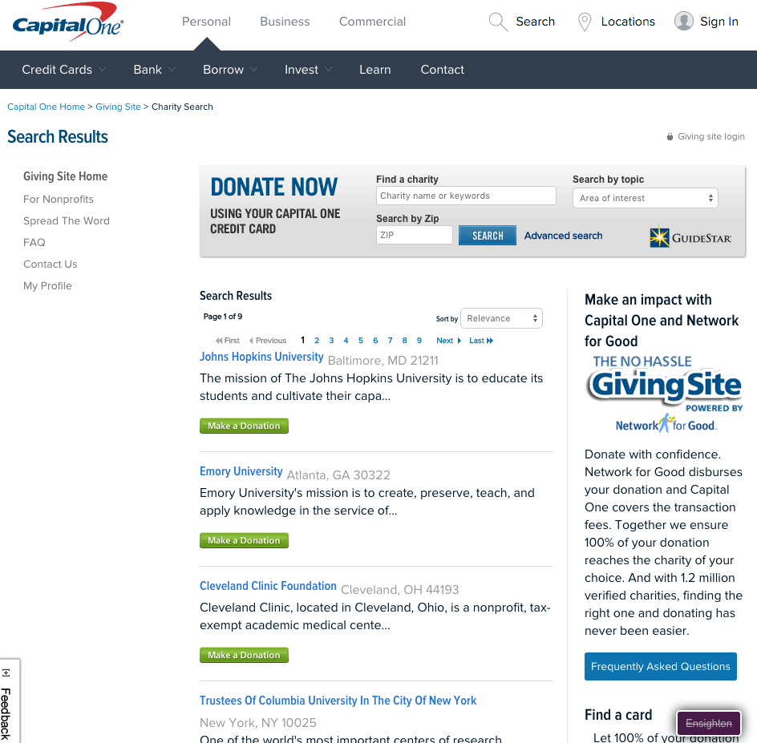
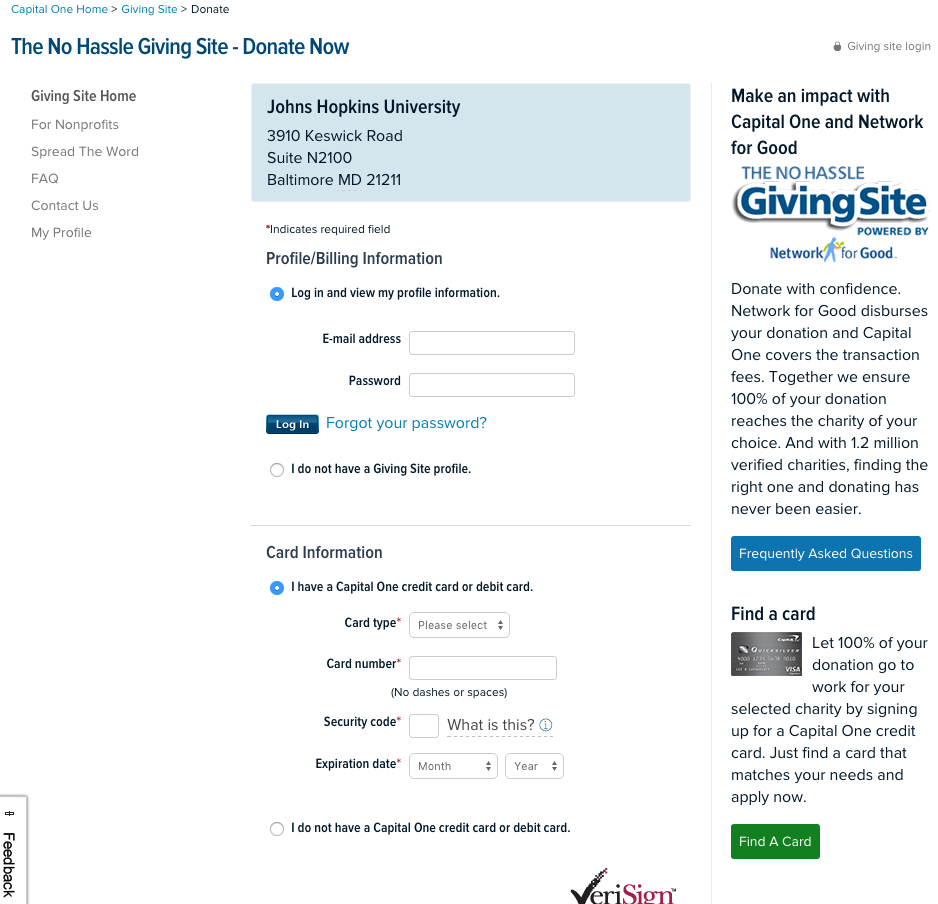

# Forgo App

> Purchase Moderater App giving users the ability to make conscious purchases

### Capital One API Credentials:
##### [documentation](http://api.reimaginebanking.com/documentation) - customer endpoints
##### api key
> I signed up at api.reimageingbanking.com

```
  6fb9265d0d9ba45104e7dccd7bfa5000
```
##### fake customers
> These are the fake customers that the api key allows us read and write access to

| customer id | name | address | no. of accounts |
| ----------- | ---- | ------- | --------------- |
| 560f0205f8d8770df0ef9b95 |	Leda Herzog	 | West Decatur, Pennsylvania 16878 |	3 |
| 560f0205f8d8770df0ef9b96 |	Randell Ruecker | Charlottesville, Virginia 22901	| 2 |
| 560f0205f8d8770df0ef9b97 |	Bobbi Heller	| State College, Pennsylvania 16803	| 3 |

### Charity API
* [Captial One 'Giving Site'](https://www.capitalone.com/give/)

> charity_id is the charity's tax identification number

| /give/ | /give/charity-search/?charity_id=[charityid] | /give/charity-details/?charity_id=[charityid] |
| ----------- | ---- | ------- | --------------- |
|   |	 	 |  |

<!--  -->


    * The query string for the search bar can be use like a rest server
```
https://www.capitalone.com/give/charity-search?keywords=%s&zipCode=ZIP&basic.x=0&basic.y=0&topic=
      ```
### Technology
* [Capital One Hackathon API](api.reimaginebaking.com) - used for account transactions
* [Google Polymer Webcomponents](polymer-project.org/1.0) - Fast Web Prototyping
* [ManifoldJS](manifoldjs.com) - maybe used to port our web app to android / iron-elements
* [FirebaseIO](firebaseio.com) - realtime database and authentication
* [Yo Polymer](https://github.com/yeoman/generator-polymer) - polymer app scaffolding
